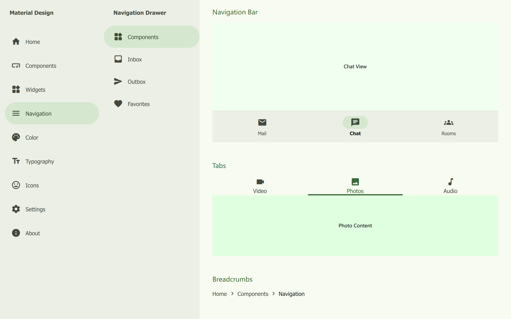
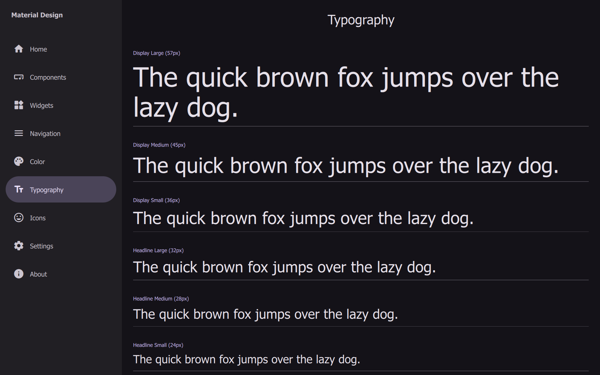
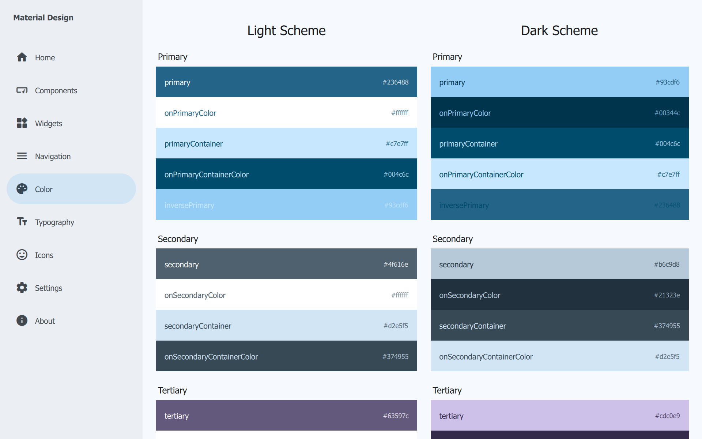

# material-components-pyside

使用 **PySide6 (Python)** 托管并运行 **Material Design 3 (Material You) QML 组件库**的示例工程。

本仓库包含两部分：

- `md3qmlcpp/material-components-qml-main/`：上游 QML 组件库与 Gallery Demo（原项目为 Qt Quick/QML + C++）
- `md3qmlpy/`：Python 运行宿主（提供 `StyleManager` 做动态取色与主题桥接）

<p align="center">
  
</p>

## 预览

<table align="center">
  <tr>
    <td></td>
    <td></td>
  </tr>
  <tr>
    <td></td>
    <td></td>
  </tr>
  <tr>
    <td></td>
    <td></td>
  </tr>
</table>

## 功能

- **MD3 组件库（QML）**：复用上游 `md3.Core` / `md3.App` 的 QML 组件与 Demo 页面
- **动态取色（Python）**：基于 `materialyoucolor`，由种子色生成 Light/Dark scheme
- **主题中心（QML）**：通过 `Theme` singleton 统一管理 color/typography/shape

## 安装与运行

```bash
py -m pip install -r requirements.txt
py -m md3qmlpy
```


